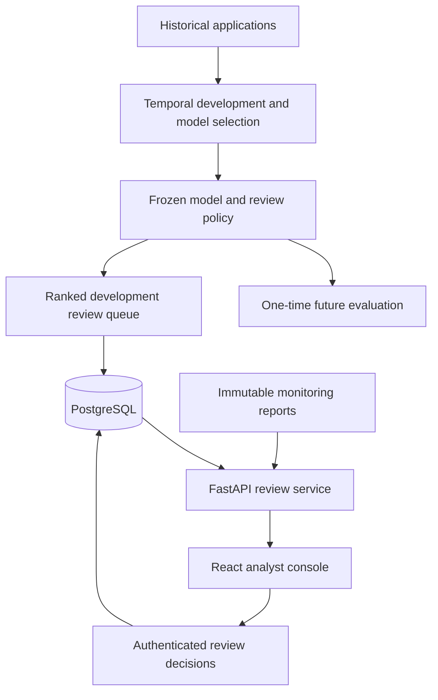

# RiskLens

**Production-oriented fraud detection, model governance, monitoring, and analyst review system**

[Live Application](https://rayyan-risklens.onrender.com)

RiskLens is an end-to-end fraud-risk platform built around a strict temporal evaluation protocol rather than a conventional random train/test split. It combines machine-learning experimentation, frozen-model governance, one-time future holdout evaluation, drift monitoring, model explanations, authentication, and a persistent analyst review workflow backed by PostgreSQL.

The project uses the **Feedzai Bank Account Fraud benchmark** containing **1,000,000 applications**. Models are developed only on historical months, selected using a predefined operational metric, frozen before the final test window is opened, and evaluated once on future data.

Rather than treating the model score as an automatic fraud decision, RiskLens uses the model as a **ranking system for a capacity-constrained analyst review queue**.

---

## Tech Stack

**Machine Learning**

- Python
- scikit-learn
- HistGradientBoosting
- Logistic Regression
- PyTorch
- NumPy
- pandas
- bootstrap evaluation
- permutation-based local explanations

**Backend**

- FastAPI
- SQLAlchemy
- Alembic
- PostgreSQL
- Pydantic
- credential-based authentication

**Frontend**

- React
- TypeScript
- Vite

**Infrastructure**

- Neon PostgreSQL
- Render
- GitHub

---

# Final Holdout Results

The final model, feature set, score semantics, and operating capacity were frozen before the untouched future test window was opened.

| Metric | Final Holdout |
|---|---:|
| Test population | 205,011 |
| Fraud cases | 2,878 |
| Fraud prevalence | 1.40% |
| Average precision (AP) | 0.1851 |
| ROC-AUC | 0.8882 |
| Brier score | 0.01253 |
| Analyst review capacity | 3% per month |
| Applications reviewed | 6,150 |
| Fraud cases caught | 1,141 |
| Recall @ 3% | 39.65% |
| Precision @ 3% | 18.55% |
| Expected fraud caught by random review | ~86 |
| TP yield vs random review | ~13.2× |

At the same 3% review capacity, random review would be expected to capture approximately 3% of fraud cases. The frozen RiskLens ranking captures approximately **39.65%**.

The model output is used as a **ranking score** and is **not presented as a calibrated probability of fraud**.

---

# System Architecture



Model training and queue generation run offline. The deployed API serves persisted
cases, explanation snapshots, review history and monitoring evidence; it is not a
live application-scoring endpoint. One Render service serves the API and the built
React frontend, with Neon PostgreSQL providing persistence.

## Evaluation protocol

| Partition | Months | Purpose |
|---|---|---|
| Training | 0–4 | Fit models and learned preprocessing |
| Validation | 5 | Model, feature and policy selection |
| Final holdout | 6–7 | One-time future evaluation after freezing |

The frozen model is `histgb_15_leaves/no_customer_age`. Its primary policy ranks
each month independently and reviews `floor(month_rows × 0.03)` applications.
The reported 39.65% recall aggregates those two monthly queues. It is distinct
from the secondary pooled ranking result of 39.47%.

Validation Recall@3% was 42.17%; final holdout recall was 39.65%, a decrease of
2.52 percentage points. This is observed generalization performance, not a reason
to tune against the already-opened holdout. Removing age does not by itself
establish fairness or remove proxy effects.

The committed [final report](reports/final_test_summary.json) and
[freeze manifest](reports/model_freeze.json) are the source of truth. The final
evaluation is complete: **do not rerun `scripts/run_final_test.py` or delete its
opening guard to produce a new result.** Future model research requires a new
version and a defensible evaluation protocol.

## Analyst workflow

- Browse the ranked queue, filter by review status, decision and minimum score.
- Inspect case features and available paired-permutation explanation snapshots.
- Record `confirmed_fraud`, `legitimate` or `escalate` decisions as an analyst.
- Preserve authenticated identity and append-only review history through the API.
- Reject stale writes with HTTP 409 using an optimistic version check.
- View calibration, temporal drift, model governance and final evaluation evidence.

The frozen operational queue uses **validation month 5**, not the final holdout:
3,579 selected cases from 119,323 applications. Explanation coverage is partial;
the initial deployment generated 50 snapshots, and the UI reports actual coverage.
Missing explanations are shown explicitly. Benchmark target labels are excluded
from the operational API.

## Demo access

Open the [deployed console](https://rayyan-risklens.onrender.com) and choose
**Explore demo** for public read-only access when enabled by the operator.
No token or account is needed. The demo exposes only the frozen synthetic BAF
month-5 workflow and monitoring evidence. Analyst notes and identities are hidden.
Review decisions still require a signed-in analyst; demo access never authenticates
requests to the private API.

Set `RISKLENS_PUBLIC_DEMO=true` on the deployed service to enable the button and
public GET endpoints. The default is disabled; set it to `false` and restart to
remove public access. See [public demo setup](docs/PUBLIC_DEMO.md).

| Role | Inspect queue and monitoring | Record decisions |
|---|---|---|
| Public demo | Frozen synthetic workflow only | No |
| Viewer | Yes | No |
| Analyst / admin | Yes | Yes |

For a supervised read-only demonstration, the operator can create a viewer
credential against the same database used by the deployed service:

```bat
python scripts\manage_credentials.py create --analyst-id demo-viewer --role viewer --hours 24
```

Run this only in a shell where `DATABASE_URL` already points to the intended
database. With no variable set, the CLI uses the local SQLite database; such a
token will not authenticate against Neon. Give the credential privately to its
intended viewer. Do not place tokens or database URLs in this repository.

The viewer signs in through the existing console. Backend authorization rejects
viewer decision writes with HTTP 403. Credentials expire and can be revoked
using their nonsecret credential ID. See [authentication](docs/AUTH_MIGRATIONS.md).

## Run locally (Windows CMD, Python 3.12)

From a fresh clone:

```bat
python -m venv .venv
.venv\Scripts\activate
python -m pip install -r requirements-api.txt
python scripts\migrate_database.py
python scripts\manage_credentials.py create --analyst-id rayyan --role analyst --hours 8
python -m uvicorn risklens_api.app:app --reload
```

Open `http://127.0.0.1:8000` and sign in with the generated token. The committed
frontend build is served by FastAPI. A fresh local database has **no review cases**;
the source repository intentionally excludes raw data, fitted models, queue
artifacts and operational database contents.

An existing development checkout with the frozen queue artifacts can import them:

```bat
python scripts\import_review_queue.py --summary reports\frozen_review_workflow_summary.json
```

Keep the original local artifacts. A fresh clone alone cannot reconstruct the
seeded queue or explanation snapshots. See [deployment](docs/RENDER_DEPLOYMENT.md)
for the existing-artifact import and explanation workflow. Do not rerun the
completed research pipeline merely to view the console.

For frontend development, run the API above and use a second terminal:

```bat
cd frontend
npm ci
npm run dev
```

Vite serves `http://127.0.0.1:5173` and proxies API requests to port 8000.
After UI edits, run `npm run build`; Render serves the committed `frontend/dist`.

## Verification and deployment

```bat
python scripts\check_deployment_readiness.py
```

This read-only check validates runtime reports, the freeze/evaluation evidence
chain, frontend build presence and deployment configuration. It does not prove
that a remote database is seeded or that the live service is reachable. A fresh
clone warns about the intentionally excluded frozen queue artifacts.

The full regression suite uses temporary fixtures and does not rerun the actual
holdout. In the existing research environment, or after installing
`requirements.txt`, run:

```bat
python -m unittest discover -s tests -v
```

The live PostgreSQL integration test needs `RISKLENS_TEST_POSTGRES_URL` pointing
to a dedicated disposable test database; otherwise that gate is skipped.

[`render.yaml`](render.yaml) defines the Python web service. Production uses
PostgreSQL, restricted hosts, disabled API docs and security headers. `/health`
checks liveness; `/ready` checks database connectivity. Follow the
[deployment guide](docs/RENDER_DEPLOYMENT.md) for configuration and migrations.
The research dependency lock and immutable evaluation reports must remain intact.

## Repository guide

| Path | Contents |
|---|---|
| `risklens_core/` | Research, metrics, governance, persistence and monitoring logic |
| `risklens_api/` | FastAPI routes, authorization, settings and review services |
| `frontend/src/` | React analyst console and monitoring interface |
| `scripts/` | Offline research and trusted operator commands |
| `migrations/` | Versioned Alembic schema migrations |
| `tests/` | Research, workflow, API and deployment regression tests |
| `reports/` | Committed immutable evidence needed by the deployed console |
| `docs/` | Protocols and milestone-specific implementation notes |

Earlier milestone documents describe the state at that milestone. For the current
project status, use this README, the committed reports and the deployment guide.

## Limitations

- BAF is a synthetic benchmark. These results do not establish real-bank performance.
- At the frozen 3% review capacity, 1,737 of 2,878 holdout fraud cases were missed;
  5,009 reviewed applications were non-fraud. Recall is not overall accuracy.
- The 3% capacity is a project assumption, not measured analyst staffing capacity.
- Scores are rankings, not validated fraud probabilities; explanations describe
  model behaviour, not causal evidence or a finding of fraud.
- Authentication supports a single-team portfolio workflow. Enterprise identity,
  tenant isolation and operational rate limiting are future work.
- Review actions demonstrate workflow behaviour; they do not automatically become
  training labels or authorize automated adverse decisions about real people.

## Further reading

- [Evaluation protocol](docs/EVALUATION_PROTOCOL.md)
- [Feature contract](docs/FEATURE_CONTRACT.md)
- [Model governance](docs/GOVERNANCE_REVIEW.md)
- [Model freeze](docs/MODEL_FREEZE.md)
- [Final holdout methodology](docs/FINAL_TEST.md)
- [Analyst console](docs/ANALYST_CONSOLE.md)
- [Monitoring dashboard](docs/MONITORING_DASHBOARD.md)
- [Production hardening](docs/PRODUCTION_HARDENING.md)
- [Feedzai BAF benchmark](https://github.com/feedzai/bank-account-fraud)
